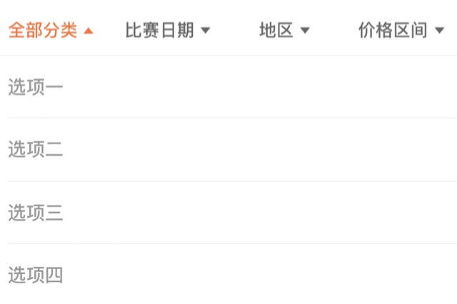
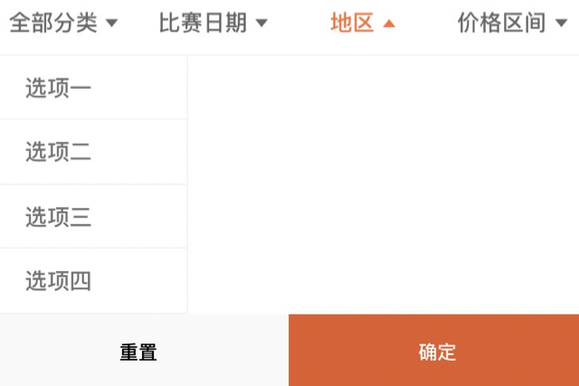
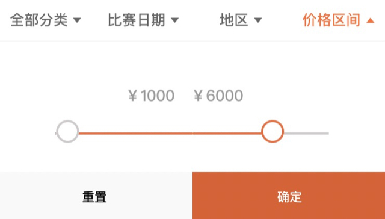
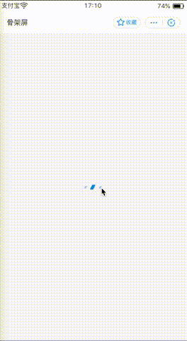

# 组件使用

* [如何录制屏幕呀](https://www.jianshu.com/p/bf3532bbc208)
* [mov转gif](https://convertio.co/zh/mov-gif/)

TODO
------

* [ ] 骨架屏有两个需求：减少侵入型、支持懒加载、不可挡住原有屏幕的交互事件、支持屏幕任意区域、是否还有更优的方案
  - H5 骨架屏怎么做？？

JS 写法注意
------

```
// 1. No 'const'
// 2. No '{
  func () {}
}'
// 3. No 'data => data'
// 4. No 'let { a } = data'
```

对话框
------

```json
{
  "defaultTitle": "页面标题",
  "usingComponents": {
    "dialog": "jx-mini-antui/dist/dialog/index"
  }
}
```

```xml
<dialog
  show="{{delDialog.show}}"
  title="{{delDialog.title}}" 
  buttons="{{delDialog.buttons}}" 
  data="{{delDialog.data}}"
  onButtonClicked="onDelConfirmed"
  >
  <text>确认将</text><text style="color:#CD162C;margin-left:10rpx;margin-right:10rpx;"> {{delDialog.username}} </text><text>移除本次活动吗？移除后退款将在24小时内原路退回至成员账户</text>    
</dialog>
```

```js

```

确认框
------

```json
{
  "defaultTitle": "修改信息",
  "usingComponents": {
    "confirm-popup": "jx-mini-antui/dist/confirm/confirm"
  }
}
```

```xml
<confirm-popup show="{{showConfirmPopup}}" title="提示" btns="{{confirmBtns}}" onBtnClick="onConfirmPopupBtnClick" onClose="onCloseConfirmPopup">
    <text>{{confirmMsg}}
    </text>
</confirm-popup>

<confirm-popup show="{{showSuccessPopup}}" title="创建成功" btns="{{successBtns}}" onBtnClick="onSuccessPopupBtnClick" onClose="onCloseSuccessPopup">
  <view class="success-popup-content">
    <image src="/images/activity_created.webp" mode="aspectFit" class="img"/>
    <view class="msg">
      <view class="msg-container" a:if="{{clubCreateResult.club_auto_created}}">
        <text>提示：活动需要从属于某一个团子\n已为您自动创建</text>
        <view class="link-btn" onTap="toClub">
          <text>查看</text>
          <view class="arrow-primary" aria-hidden="true" />
        </view>
      </view>
      <block a:else>提示：此活动归属于您的”
        <text class="club-name">{{clubCreateResult.club_name}}
        </text>...
      </block>
    </view>
  </view>
</confirm-popup>
```

筛选栏 
------

```css

.filter-bar {
  position: sticky; // 顶部停靠
  margin-top: 0rpx;
  background-color: #EBEBEB;
  z-index: 2;
}

```

```json
{
  "usingComponents": {
    "filter-bar": "jx-mini-antui/dist/filter/index"
  },
  "pullRefresh": false
}
```


```xml
<filter-bar className="filter-bar" />
```

牛逼的筛选栏
------






```json
{
  "usingComponents": {
    "filters-bar": "jx-mini-antui/dist/filters/index"
  }
}
```

```js
filterTitles: ['全部分类', '比赛日期', '地区', '价格区间'],
filterItems: [
  {
    type: 'single',
    items: ['选项一', '选项二', '选项三', '选项四'],
    keypath: '', // 如果keypath有效，则会对items中的对象进行萃取
    selected: ''
  }, 
  {
    type: 'double',
    items: [['选项一', '选项二', '选项三', '选项四'], ['选项一', '选项二', '选项三', '选项四']],
    keypath: '', // 如果keypath有效，则会对items中的对象进行萃取
    selected: ['', '']
  }, 
  {
    type: 'triple',
    items: [
      ['选项一', '选项二', '选项三', '选项四'], 
      {
        '选项一': ['选项一', '选项二', '选项三', '选项四', '选项五'], 
        '选项二': ['选项一', '选项二', '选项三', '选项四'], 
        '选项三': ['选项一', '选项二', '选项三', '选项四'], 
        '选项四': ['选项一', '选项二', '选项三', '选项四']
      }, 
      {
        '选项一': ['选项一', '选项二', '选项三', '选项四'], 
        '选项二': ['选项二', '选项三', '选项四'], 
        '选项三': ['选项一', '选项三', '选项四'], 
        '选项四': ['选项一', '选项二', '选项三', '选项四'],
        '选项五': ['选项一', '选项二', '选项三']
      }],
    keypath: '', // 如果keypath有效，则会对items中的对象进行萃取
    selected: ['', '', '']
  }, 
  {
    type: 'price',
    items: [
      { // min
        min: 0,
        max: 10000
      }, { // max
        min: 0,
        max: 10000
      }
    ],
    default: [1000, 6000],
    selected: ['', '']
  }
]
```

```xml
<filters-bar 
  className="filters-bar" 
  titleItems="{{filterTitles}}" 
  contentItems="{{filterItems}}" 
  onChange="onFilterChange" />
```


```css
/* title's z-index = 10, content's z-index=9, mask's z-index=8 */
/* 父级不可使用 overflow: hidden; */
/* 如果下层列表需要在 mask 状态禁止滑动：则对列表container加
    overflow: hidden; 需要动态控制
    <view style="overflow: hidden;width: 100vw;height:100vh;"> 
    overflow 实际上会有很多体验上的问题, 后续研究 @TODO
*/
.filters-bar {
  position: sticky;
  top: 0;
  background-color: #fff;
  height: 81rpx;
}
```

选项卡
------

```json
{
  "usingComponents": {
    "tab-bar": "jx-mini-antui/dist/tabs/index"
  }
}
```


```xml
<tab-bar
  className="tab-bar"
  tabs="{{tabs}}"
  showPlus="{{false}}"
  onTabClick="handleTabClick"
  onChange="handleTabChange"
  onPlusClick="handlePlusClick"
  activeTab="{{activeTab}}"
  swipeable="{{true}}">
</tab-bar>
```


```css
.tab-bar {
  position: sticky;
  z-index: 100; 
  top: 0rpx;
}
```

骨架屏
------



```json
"usingComponents": {
  "skeleton": "/dev/skeleton/index"
}
```

```xml
<skeleton
  width='100vw'
  height="100vh"
  left='0' 
  top='0'
  loading="chiaroscuro" 
  a:if="{{showSkeleton}}"/>

<!-- 关注 sk -->
<view class="container sk">
  <view class="userbanner sk-layer">
    <view class="banner-item sk-rect-12"></view>
  </view>

  <view class="userinfo sk-layer">
    <block> 
      <image class="userinfo-avatar sk-circle" src="{{userInfo.avatarUrl}}" mode="cover"></image>
      <text class="userinfo-nickname sk-rect">{{userInfo.nickName}}</text>
    </block>
  </view>

  <view class="useritems sk-layer-6">
    <view a:for="{{lists}}" a:for-index="index" class="lists">
      <icon type="success" size="20" class="head sk-circle"/>
      <text class="text sk-rect">{{item}}</text>
      <view class="line sk-line"></view>
    </view>
  </view>
</view>
```

```js
data: {
  userInfo: {
    avatarUrl: 'https://sfault-image.b0.upaiyun.com/117/579/1175792133-5b63fce811636_articlex',
    nickName: 'jayzou'
  },
  lists: [
    'aslkdnoakjbsnfkajbfk',
    'qwrwfhbfdvndgndghndeghsdfh',
    'qweqwtefhfhgmjfgjdfghaefdhsdfgdfh',
    'qweqwtefhfhgmjfgjdfefdhsdfgdfh',
    'qweqwtefhfhgmjfgjdfghaefdhh',
    'qweqwtefhfhgmjfgjdfghaefdhsddsfaewafsfasah',
    'qweqwtefhfhgmjf',
    'qweqwtefhfhgmjfgjdfghaefdhsdfgdfh',
    'qweqwtefhfhgmjdfgdfh',
    'qw',
  ],
  showSkeleton: true
}

that.setData({
  showSkeleton: false
})
```